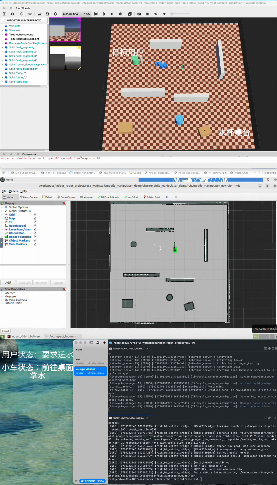

# Human-Calibrated Risk-Sensitive Decision Making for Non-Intrusive Assistive Mobile Manipulation

A PhD application research prototype for studying when a service robot should directly hand over, cautiously hand over, place nearby, wait safely, or retreat.

## What This Project Is

- A research prototype for service-robot high-level decision making.
- A factorized decision sandbox using `user_state + event_state + risk_state`.
- A risk-sensitive behavior-tree policy over five service actions.
- A Webots/RViz branch-mapping demonstration.
- A preliminary human preference calibration prototype.

## What This Project Is Not

- Not a complete service robot product.
- Not a formal user study.
- Not a trained RL/PPO system.
- Not full online perception-conditioned deployment.
- Not a real grasping or MoveIt manipulation system.

## Demo Video

### Case A: Webots/RViz Branch Mapping Demo

Context:

```text
user_state = requesting_water
event_state = none
risk_state = near_user_block
selected_action = cautious_handover
```

The clip shows that the `selected_action` from the decision sandbox can be mapped to ROS/Webots/RViz execution branches: navigation goal, arm pose sequence, marker visualization, and run log.

[](media/case_a_demo_video_compressed.mp4)

Click the thumbnail above to watch the compressed Case A Webots/RViz branch-mapping demo.

Note: the compressed `.mp4` is small enough to keep in the public demo repository. Higher-quality video sources are kept outside this public repository.

Important: this validates branch mapping, not full online deployment.

## Key Results

### Main Policy Comparison

| Policy | Action Correct | Unsafe Continue | Avg. Total Cost |
|---|---:|---:|---:|
| `fixed_policy` | 0.5515 | 0.1636 | 55.39 |
| `rule_based_policy` | 0.8061 | 0 | 26.65 |
| `risk_sensitive_policy` | 0.9818 | 0 | 18.57 |

### Safety Stress Test

| Variant | Hard Safety Violation | Unsafe Continue | Prevented Unsafe Selection |
|---|---:|---:|---:|
| `no_safety_override` | 1.0 | 1.0 | 0 |
| `full_policy` | 0 | 0.395 under tempting direct cost | 1.0 |

Interpretation: hard safety override acts as a fail-safe when the cost model underestimates risk or over-rewards direct handover.

### Preference Calibration

35 direct human preference labels:

| Preferred Action | Count |
|---|---:|
| `cautious_handover` | 11 |
| `place_nearby` | 10 |
| `safe_wait` | 9 |
| `direct_handover` | 0 |
| `abort_or_retreat` | 0 |

Interpretation: service completion should not be defined only as direct handover; nearby placement can also be an appropriate service-completion mode.

## Current Limitations

- Synthetic decision sandbox.
- Hand-designed oracle and risk weights.
- 35 direct labels only; not a formal user study.
- Rule-based preference update, not RL/PPO.
- Webots/RViz branch mapping only, not full online deployment.
- Full implementation and raw logs are kept private during the application stage.

## PhD Direction

- Continuous belief states.
- Human-calibrated risk value functions.
- Safe preference-adaptive online learning.
- Online observe-decide-act-reassess loop.
- Multi-task assistive mobile manipulation.

## Access to Full Source

The full implementation is kept in a private repository during the PhD application stage and can be shared with academic reviewers upon request.

## Repository Contents

- `docs/`: one-page briefs, limitations, and public research claims.
- `media/`: public screenshots and demo thumbnail placeholders.
- `results/`: summary-level result notes only.
- `demo/`: Case A branch-mapping explanation.

This public repository intentionally excludes full source code, raw experiment logs, raw human label tables, private drafting materials, contact lists, and outreach drafts.
